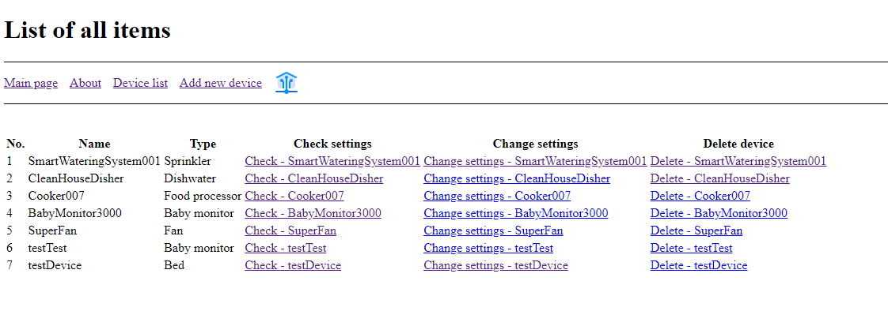

# StudyProjects

This repository shows some educational projects that demonstrate the practical application of different skills.

## Content

1.  ### [**Web development projects**](Webdev/) (both front-end: HTML/CSS/JS/AJAX, and back-end: NODE/Express/MySQL):

    - [**Theme park website, front-end project:**](Webdev/Frontend_ThemeparkWebsite/)

      <ins>Description:</ins> This is my first-year team project for the 'Web development' module. It is a simple 3-page website with a sprinkle of basic JS and CSS. Nothing fancy here, just the basics of HTML tags, CSS styles (Bootstrap styles and custom handmade ones), and JS(jQuery). Also, we used a couple of libraries (owlCarousel, magnificPopup and slick) for things like slideshows and pop-ups. The website is also adapted for a range of mobile devices (desktop first).

      <ins>Prerequisites:</ins> None.

      <ins>Entry point:</ins> Just start from the [index.html](Webdev/Frontend_ThemeparkWebsite/index.html) using any browser or web preview extension.

      <ins>Screenshots:</ins>
      
      Fig.1: Theme Park Website - Main page
      
      Fig.2: Theme Park Website - Main page 2
      
      Fig.3: Theme Park Website - Attractions map

    - [**Smarthome web application, back-end project:**](Webdev/Backend_SmarthomeWebapp/)

      <ins>Description:</ins> This is my second-year project for the 'Databases' module. A web-based application to connect and manage your smart devices. Built with Javascript using Node.js as a runtime environment. The server functionality is built with the help of the 'Express.js' framework. For the templating purposes, I used the 'EJS' template engine. The database is built using basic SQL (MariaDB was the DBMS of my choice) and integrated using the Node module 'Mysql'. Basic security functionality is built with the help of the 'md5' and 'cookie-parser' modules. This application is very primitive in sense of front-end, the only thing worth mentioning is the introduction of AJAX methods to allow for a more comfortable user experience.

      <ins>Prerequisites:</ins>

      - Node.js
      - Dependencies from the [package.json](Webdev/Backend_SmarthomeWebapp/package.json)
      - Project database, import the file from the ['dump'](Webdev/Backend_SmarthomeWebapp/dump/) folder.

      <ins>Entry point:</ins>
      The ['index.js'](Webdev/Backend_SmarthomeWebapp/index.js) file, just adjust the settings (variables 'port' [default - 8089] and 'dbconfig' on the lines 33 and 35) and execute using node (node index.js).

      <ins>Screenshots:</ins>
      
      Fig.4: Smarthome Application - Device list
      
      Fig.5: Smarthome Application - Device status page
      
      Fig.6: Smarthome Application - Add device page

    - [**Recipe web application, full stack project:**](Webdev/Fullstack_RecipeWebapp/)

      <ins>Description:</ins>
      This is my second-year "team" project [^1] for the 'Agile methods' module. A web-based application that stores the base of different recipes. Same as the previous one, this app is built with Node/Express/MySQL. This application works with different types of users (user and super-user), authentication (implemented a couple of security features), and supports CRUD operations (because of the time constraints, only the admin can add and delete recipes). It also works with user-uploaded files and has a basic 'admin panel' and mechanism for search and filtering. The front end is also done by hand, with no CSS frameworks. I tried to implement some good practices for the best UI/UX. This application actively uses AJAX methods to pass the data between the user and the server without the need of reload. There are a lot of DOM manipulations through the JS scripts to adjust the content dynamically, based on the user input.

      [^1]: The project was supposed to be done by a team of 6 people. Initially, I planned more functionality (like recipe price calculation based on the geo-location, user submissions, user ratings, user favorite tab, admin panel that allows working with all tables, etc.), but when it become apparent the team posses neither skills required, nor the will required to make this project stand out, I basically started to work solo, and completed it alone (because of the time constraints I left behind some initial ideas).

      <ins>Prerequisites:</ins>

      - Node.js
      - Dependencies from the [package.json](Webdev/Fullstack_RecipeWebapp/package.json)
      - Project database, import the file from the ['dump'](Webdev/Fullstack_RecipeWebapp/dump/) folder.

      <ins>Entry point:</ins>
      The ['index.js'](Webdev/Fullstack_RecipeWebapp/index.js) file, just adjust the settings (variable 'port' [default - 8087] (line 18) and 'configDB' file in ['config'](Webdev/Fullstack_RecipeWebapp/config/) folder) and execute using node (node index.js).

      <ins>Screenshots:</ins>
      
      Fig.7: Smarthome Application - Main page
      
      Fig.8: Smarthome Application - Recipe page
      
      Fig.9: Smarthome Application - Admin panel

2.  ### [**JS projects**](JS/) (basic JS and p5.js library):

    - [**2D Platformer game, web application:**](JS/p5js_2dPlatformerGame/)

      <ins>Description:</ins>
      This is my first-year project [^1] for the 'Introduction to programming' module. I grew up with a Dendy/NES and played a lot of 2d platformer games, so this project was my attempt to create something similar. It is built on Javascript, with the help of the 'p5.js' framework which provides ample tools for working with media (both graphics and audio). This project taught me the basics of Javascript and graphics programming.

      <ins>Prerequisites:</ins>
      The p5 library files (both ['p5.min.js'](JS/p5js_2dPlatformerGame/p5.min.js) and ['p5.sound.js'](JS/p5js_2dPlatformerGame/p5.sound.js) included in the project).

      <ins>Entry point:</ins>
      The ['index.html'](JS/p5js_2dPlatformerGame/index.html). Because of the CORS cross-origin policies, you need to serve this project on the server (or through the live preview).

      <ins>Screenshots:</ins>
      
      Fig.10: 2D Game - Screenshot#1
      
      Fig.11: 2D Game - Screenshot#2
      
      Fig.12: 2D Game - Screenshot#3

    - [**Audio Player/Visualisator, web application:**](JS/p5js_AudioPlayerVisualisator/)

      <ins>Description:</ins>
      This is my second-year project for the 'Introduction to programming' module. This one was focused on the representation of audio on a computer. My project for this module is an audio player with an equalizer(audio visualization, 9 different types) to combine audio with graphics. This project is also the first one where I worked with the JS classes.

      <ins>Prerequisites:</ins>
      p5 library files (both ['p5.min.js'](JS/p5js_AudioPlayerVisualisator/p5.min.js) and ['p5.sound.js'](JS/p5js_AudioPlayerVisualisator/p5.sound.js) included in the project).

      <ins>Entry point:</ins>
      The ['index.html'](JS/p5js_AudioPlayerVisualisator/index.html). Because of the CORS cross origin policies, you need to serve this project on the server (or through the live preview).

      <ins>Screenshots:</ins>
      
      Fig.13: Audio Player Visualisator - Screenshot#1
      
      Fig.14: Audio Player Visualisator - Screenshot#2
      
      Fig.15: Audio Player Visualisator - Screenshot#3

3.  ### Object Oriented Programming (basic C++ and JUCE application framework):

- [**Crypto exchange emulator, terminal application:**](OOP/CPP_TerminalApp/)

  <ins>Description:</ins>
  This is my second-year midterm project for the 'Object Oriented Programming' module. It is also my first project on C++. Despite the steep learning curve, I liked this language, and the OOP in general. This project thought me the basics of C++ (basic data types, standard library methods, compiling, linking, etc).

  <ins>Prerequisites:</ins>
  CSV file with the data from the crypto exchange. There are 3 files included: 2 test files with limited amounts of data, and one that contains a big amount of data (more than one billion transactions). To try different data you have to change ['AdvisorBot.h'](OOP/CPP_TerminalApp/AdvisorBot.h) file (lines 13-15, just uncomment one).
  You may also want to recompile the project, just in case.

  <ins>Entry point:</ins>
  The ['main.cpp'](OOP/CPP_TerminalApp/main.cpp) file, just compile (I used g++), linking all other files.
  You can also try launch using already compiled executable ['runme'](OOP/CPP_TerminalApp/runme.exe).

  <ins>Screenshots:</ins>
  
  Fig.16: Crypto exchange - Interface
  
  Fig.17: Crypto exchange - "Max" command
  
  Fig.18: Crypto exchange - "Plot" command

- [**Otodecks - DJ mixing deck, JUCE application:**](OOP/CPP_JUCE_djMixingApp/)

  <ins>Description:</ins>
  This is my second-year final project for the 'Object Oriented Programming' module. This is the second project on C++ and focuses more on the principles of the OOP. This application was built using the JUCE framework, which has a lot of tools for graphical user interfaces for the desktop app. Through this project, I learned and practiced more advanced OOP concepts (encapsulation, abstraction, polymorphism, and inheritance), and the basics of project building in the Visual Studio.

  <ins>Prerequisites:</ins>
  The ['JUCE Framework'](https://juce.com/get-juce/download).
  To try this application you need to build it:

  - Load ['Otodecks.jucer'](OOP/CPP_JUCE_djMixingApp/Otodecks.jucer) in Projucer;
  - Build the solution;
  - Run the executable;

  <ins>Entry point:</ins>
  The ['Main.cpp'](OOP/CPP_JUCE_djMixingApp/Source/Main.cpp).

  <ins>Screenshots:</ins>
  
  Fig.19: DJ Mixer - Interface
  
  Fig.20: DJ Mixer - "Max" command
  
  Fig.21: DJ Mixer - "Plot" command

4. ### Python:

   - [**Analyzing the internet memes, data analysis using Python**](Python/Pandas_Numpy_Matplot_DataAnalysis.ipynb)

     <ins>Description:</ins>
     This is my second-year midterm project for the 'Programming with data' module. It is also my first project on Python. It is a really unpopular opinion, but after C++ I didn't like the Pythons 'easy to comprehend' feature. But, despite my personal preferences, I learned to respect the rich selection of very powerful libraries, especially for working with data. Also, I practiced different aspects of work with data: collection (using files, scraping data, or using/creating the API-s), cleaning and modification (data types, incorrect or missing data, etc.), and finally the analysis itself. Please keep in mind, I tried to make statistical analysis, but I'm not sure that it's correct in terms of methods and conclusions.
     The work itself is done as the Jupyter Notebook, using basic Python and popular libraries for working with data (Pandas, NumPy, MatPlotLib, Wordcloud), as well as some others (socket, requests, urllib, etc.). This project is also the first one, where I tried multithreading (using 'concurrent' library), to speed up the data scraping.

     <ins>Prerequisites:</ins>
     This project uses bunch of libraries, but they all are present in the body of the work. To launch it, all you need is the ['Jupyter notebook EDE'](https://jupyter.org/install) or load the file to the ['online environment'](https://jupyter.org/try-jupyter).

     <ins>Entry point:</ins>
     The ['Pandas_Numpy_Matplot_DataAnalysis.ipynb'](Python/Pandas_Numpy_Matplot_DataAnalysis.ipynb) file.

     <ins>Screenshots:</ins>
     
     Fig.22: Data Analysis - Screenshot#1
     
     Fig.23: Data Analysis - Screenshot#2
     
     Fig.24: Data Analysis - Screenshot#3
